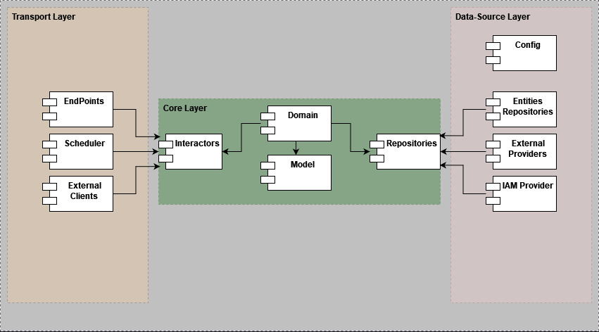

# cv-manager-backend

The CV Manager App is an application designed to help users efficiently create, manage, and track their curriculum vitae (CV) or resumes.

## Ready for changes with Hexagonal Architecture and DDD

This application is designed based on the Hexagonal Architecture, also known as Ports and Adapters architecture. The main idea behind this architecture is to decouple the core business logic of the application from external dependencies, such as databases, UI frameworks, and other external systems.

Firstly, we define the principles for dividing our code. The hexagonal architecture defines the internal and external parts.

What we did was divide our application into three layers: Transport (external), core (internal), and data-source (external):



## Core Layer

The `core` folder contains the core components of the application:

### Domain:

Contains the domain models and services.

### Model:

This folder holds the domain models or entities of the application. These models represent the core business concepts and encapsulate the data and behavior related to them.

### Service:

This folder contains domain services that encapsulate complex business logic not fitting naturally within a specific entity. Domain services implement the business logic associated with each use case and orchestrate the interactions between the domain models, services, and repositories.

### Interactors

The `interactors` folder represents the application's use cases:

Use cases define the specific actions or tasks that the application can perform to fulfill user requirements. Each use case typically corresponds to a specific user goal or action.

### Repositories

The `repositories` folder holds the implementation of data access and persistence logic:

The repositories layer provides an interface for interacting with the underlying data storage. They typically encapsulate operations related to CRUD (Create, Read, Update, Delete) operations for the domain models.

This folder architecture aims to provide a structured and organized approach to developing the project, separating concerns and promoting maintainability.

## Transport Layer

The `transport` layer is responsible for handling the communication and interaction between the application and external systems or user interfaces.

## Data Source Layer

The `data-source` layer is responsible for managing the data persistence and external service integration aspects of the application.

### Repository

The `Entities repositories` folder contains the implementation of the repository modules. Repositories are responsible for interacting with the underlying data storage systems, such as databases or external services. They provide an abstraction layer for performing CRUD (Create, Read, Update, Delete) operations on the data, encapsulating the specific details and technologies used for data access.

### Entity

The `entity` folder (or `daos`) holds the Data Access Objects (DAOs) used in the data source layer. DAOs are responsible for handling low-level database or external service interactions. They provide methods for performing specific data operations, such as querying the database, executing database transactions, or invoking external APIs.

### External Services

The `external-services` folder contains modules related to integrating with external services or APIs. These modules encapsulate the logic for interacting with external systems, handling authentication, making HTTP requests, and processing responses. They provide an interface for the application's core or repositories to communicate with external services.

### Configuration

The `configuration` folder (or `config`) may hold configuration files or modules related to the data source layer. This includes database connection configuration, external service credentials, or any other configuration required for the data access and integration aspects of the application.

## File Tree

```
src                                                             
└─ main                                                         
   ├─ java                                                      
   │  └─ com                                                    
   │     └─ fbaron                                              
   │        └─ cvmanager                                        
   │           ├─ common                                        
   │           │  ├─ exception                                  
   │           │  │  ├─ ResourceNotFoundException.java          
   │           │  │  └─ ServiceErrorHandler.java                
   │           │  └─ rest                                       
   │           │     └─ RestTemplateBean.java                   
   │           ├─ profile                                       
   │           │  ├─ core                                       
   │           │  │  ├─ domain                                  
   │           │  │  │  ├─ model                                
   │           │  │  │  │  ├─ Education.java                    
   │           │  │  │  │  ├─ PersonalInformation.java          
   │           │  │  │  │  ├─ Profile.java                      
   │           │  │  │  │  ├─ Skill.java                        
   │           │  │  │  │  └─ WorkExperience.java               
   │           │  │  │  ├─ DomainCreateProfileService.java      
   │           │  │  │  ├─ DomainGetAllProfilesService.java     
   │           │  │  │  ├─ DomainGetProfileByIdService.java     
   │           │  │  │  └─ DomainUpdateProfileService.java      
   │           │  │  ├─ interactors                             
   │           │  │  │  ├─ CreateProfileService.java            
   │           │  │  │  ├─ GetAllProfilesService.java           
   │           │  │  │  ├─ GetProfileByIdService.java           
   │           │  │  │  └─ UpdateProfileService.java            
   │           │  │  └─ repositories                            
   │           │  │     ├─ CreateProfileRepository.java         
   │           │  │     ├─ FindAllProfilesRepository.java       
   │           │  │     ├─ FindProfileByIdRepository.java       
   │           │  │     └─ UpdateProfileRepository.java         
   │           │  ├─ data                                       
   │           │  │  ├─ config                                  
   │           │  │  │  └─ ProfileConfig.java                   
   │           │  │  ├─ jpa                                     
   │           │  │  │  ├─ entity                               
   │           │  │  │  │  └─ ProfileEntity.java                
   │           │  │  │  ├─ mapper                               
   │           │  │  │  │  └─ ProfileJpaMapper.java             
   │           │  │  │  ├─ repository                           
   │           │  │  │  │  └─ ProfileJpaRepository.java         
   │           │  │  │  └─ ProfileJpaAdapter.java               
   │           │  │  └─ mongo                                   
   │           │  │     ├─ document                             
   │           │  │     │  ├─ Education.java                    
   │           │  │     │  ├─ PersonalInformation.java          
   │           │  │     │  ├─ ProfileDocument.java              
   │           │  │     │  ├─ Skill.java                        
   │           │  │     │  └─ WorkExperience.java               
   │           │  │     ├─ mapper                               
   │           │  │     │  └─ ProfileMongodbMapper.java         
   │           │  │     ├─ repository                           
   │           │  │     │  └─ ProfileMongodbRepository.java     
   │           │  │     └─ ProfileMongodbAdapter.java           
   │           │  └─ transport                                  
   │           │     └─ rest                                    
   │           │        ├─ controller                           
   │           │        │  └─ ProfileRestController.java        
   │           │        ├─ dto                                  
   │           │        │  ├─ CreateProfileDTO.java             
   │           │        │  ├─ EducationDTO.java                 
   │           │        │  ├─ PersonalInformationDTO.java       
   │           │        │  ├─ ProfileDTO.java                   
   │           │        │  ├─ SkillDTO.java                     
   │           │        │  ├─ UpdateProfileDTO.java             
   │           │        │  └─ WorkExperienceDTO.java            
   │           │        └─ mapper                               
   │           │           └─ ProfileDtoMapper.java             
   │           └─ Application.java                              
   └─ resources                                                 
      ├─ application.yaml                                       
      ├─ banner.txt                                             
      └─ env.yaml                                   
```

### What You Need

-[Java SE Development Kit 17.0.6](https://download.oracle.com/java/17/archive/jdk-17.0.6_windows-x64_bin.msi) - The software that provides development tools for creating Java programs.

-[Postman](https://www.postman.com/downloads/) - It is an application that allows us to perform API testing.

-[Git](https://gitforwindows.org/) -  It is a distributed version control system.

-[IntelliJ IDEA Community Edition](https://download-cdn.jetbrains.com/idea/ideaIC-2023.1.2.exe) -  The IDE for pure Java and Kotlin development.

### Clone the GitHub repository from the terminal or Git Bash.

```bash
git clone https://github.com/ferneybaron/cv-manager-backend.git
```

### Build the Application

```bash
./gradlew build
```

### Run the Application
```bash
./gradlew bootRun
```

### OpenAPI definition
```bash
http://localhost:8080/cv-manager/swagger-ui/index.html
```
This folder architecture promotes separation of concerns, allowing for a clear distinction between the application's core functionality and the data persistence and external service integration aspects.